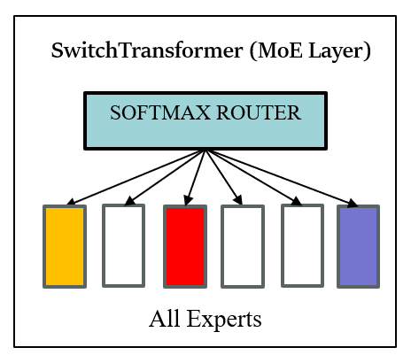
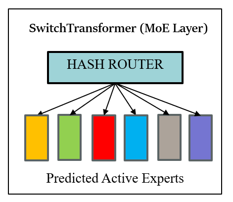
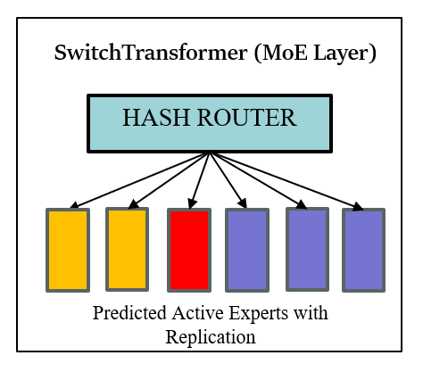
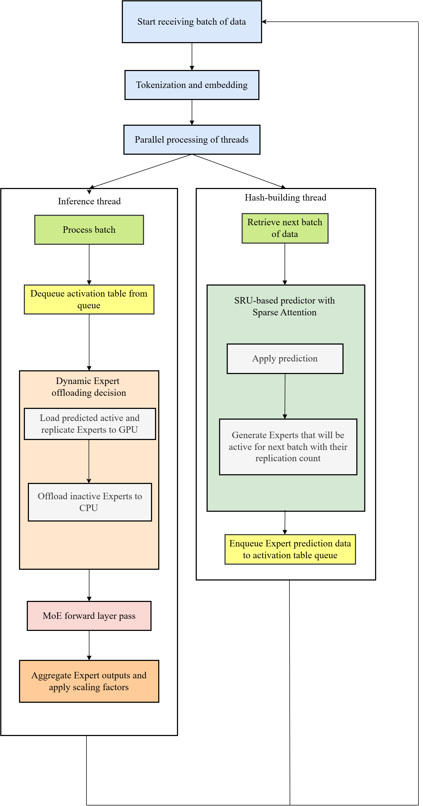

# MoE-MPMC
Fast Mixture-of-Experts Inference via Predictive Prefetching and Expert Replication  
(Code Artifact for SC 25)
---


MoE-MPMC is a system that accelerates inference for Mixture-of-Experts (MoE) language-model layers.  
The key idea is to **predict** which experts will be active in the *next* batch and then **replicate** those hot experts on the GPU so that concurrent tokens never wait in line.

* **Predictive prefetching** is handled by a lightweight 10-layer Simple Recurrent Unit (SRU) that achieves roughly 99.4% accuracy in matching the soft-max router.
* **MPMC replication** (Multiple-Producer Multiple-Consumer) deep-copies each predicted expert just enough times to saturate GPU compute, subject to a hard cap that avoids memory overflow.
* The method is applied at inference and prediction is learnt during finetuning.

---

## Paper contributions (in brief)

1. **SRU-based next-batch expert prediction** reduces routing overhead compared with the LSTM used in prior work of SiDA-MoE.  
2. **Data-aware expert replication** removes token queuing and lifts GPU utilisation from single-digit percentages in baseline SwitchTransformers to above 90 % on A100-80 GB.  
3. **End-to-end speed-up** of up to three times latency on Switch-Base-128 while maintaining 90–95 % of baseline accuracy.  

---


## 📚 Architecture Comparisons

### 1. SwitchTransformers Expert Layout

A traditional SwitchTransformers model where **all experts are loaded**, causing underutilization of GPU resources:

<p align="center">
  
</p>

---

### 2. SiDA-MoE Expert Layout

**SiDA-MoE** improves efficiency by loading **only the predicted active experts** for the batch:

<p align="center">
  
</p>

---

### 3. MoE-MPMC Expert Layout (Ours)

**MoE-MPMC** further advances the strategy by **predicting and replicating active experts** based on load, achieving **maximum parallelism and throughput**:

<p align="center">
  
</p>


**Workflow** for the paper is given below:
<p align="center">
  
</p>

# 🚀 Project Setup and Execution Guide

This project uses **Python 3.8.20**, **Micromamba 1.4.2**, and requires **SLURM version > 24**. Follow the steps below carefully to set up the environment and run the SLURM jobs.

---

## 🛠️ Setup Instructions

### 1. Install Python 3.8.20

We recommend using [pyenv](https://github.com/pyenv/pyenv) to install and manage Python versions.

```bash
# Install pyenv
curl https://pyenv.run | bash

# Restart your shell (or source ~/.bashrc or ~/.zshrc depending on your shell)
source ~/.bashrc

# Install Python 3.8.20
pyenv install 3.8.20

# Set local version for this project
pyenv local 3.8.20

python --version
# Expected output: Python 3.8.20

# Install Micromamba
curl micro.mamba.pm/install.sh | bash

# Source your shell config file again
source ~/.bashrc

# Verify micromamba installation
micromamba --version
# Expected output: micromamba 1.4.2

# Create environment
micromamba create --file environment.yml --name myenv

# Activate the environment
micromamba activate myenv

#Install additional packages in requirements.txt
pip install -r requirements.txt

scontrol --version
# Example expected output: slurm 24.05.2

#Submit the job using below command
sbatch job_runner.sh


